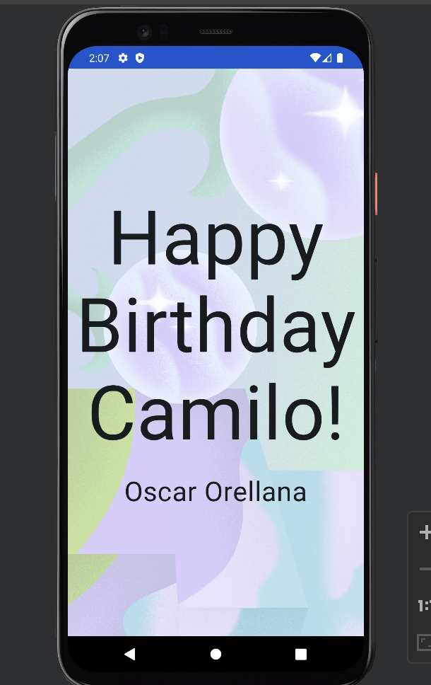

# Birthday Card App

  

## Overview

This project is part of the official Android Basics in Kotlin course, specifically in the "Compose" unit. The goal is to design a simple birthday card app using Jetpack Compose.

## Course Details

To follow along with the tutorial and understand the concepts covered in this project, you can visit the official Android Developer website:

[Android Basics in Kotlin - Compose Unit 1 Pathway 3](https://developer.android.com/courses/pathways/android-basics-compose-unit-1-pathway-3)

## Project Structure

The project is structured as follows:

- `app/`: Contains the main source code for the birthday card app.
- `res/`: Includes resources such as images and layouts.